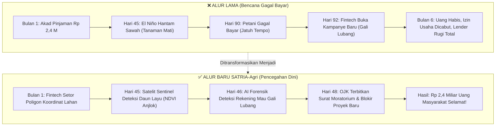

# 📄 One-Pager & Slide Deck: Menyelamatkan Fintech Pertanian dengan Satelit & Agentic AI

> **Versi Bahasa Awam & Eksekutif (Bisa Dipakai untuk Slide Presentasi 5 Menit)**  
> *Inisiatif SupTech OJK: Project SATRIA-Agri (Surveillance & Automated TKB Resilience Intelligence Agents)*

---

## 🚗 1. The Hook & Analogi Sehari-hari

> *"Pengawas OJK memeriksa buku servis mobil di atas meja, padahal mesin mobil di luar sudah meledak terbakar."*

* **Kenyataan Saat Ini:**  
  OJK hanya mengaudit **Laporan Keuangan PT Penyelenggara** (apakah modalnya memenuhi syarat Rp 12,5 Miliar). Di atas kertas perusahaannya tampak sehat.
* **Fakta Lapangan:**  
  Di sawah ratusan kilometer dari Jakarta, tanaman jagung/padi petani sudah mati kering terbakar El Niño sejak 3 bulan lalu. Uang ratusan miliar rupiah milik masyarakat (*lender*) sudah hangus tanpa ada yang tahu.

---

## 📊 2. Empat Angka Kunci (Key Figures)

1. **135 Hari (Keterlambatan Deteksi):**  
   Jeda waktu dari saat tanaman mati di sawah (Hari 45) sampai resmi diakui macet di sistem pelaporan OJK (Hari 180).
2. **10 Meter (Ketajaman Satelit):**  
   Resolusi citra satelit Sentinel-2 dari luar angkasa yang memantau kesehatan tanaman secara gratis setiap 5 hari.
3. **H-60 Hari (Peringatan Dini):**  
   AI Agen mendeteksi potensi gagal bayar 2 bulan sebelum tanggal jatuh tempo pinjaman petani.
4. **100% (Dana Masyarakat Terlindungi):**  
   Mencegah skema gali lubang tutup lubang (*evergreening*) menjebak ratusan *lender* ritel baru.

---

## 🔄 3. Visual Flowchart: Dari Bencana Menjadi Solusi

---

## 🤖 4. Empat Agen AI (Dijelaskan dengan Bahasa Awam)

Alih-alih mengirim auditor keliling ribuan sawah di pelosok Indonesia, OJK mempekerjakan **4 Detektif Digital 24 Jam**:

1. **🛰️ 1. Si Mata Elang (Agen Satelit & Cuaca)**  
   *Tugas:* Memotret sawah dari luar angkasa. Memastikan apakah sawah itu beneran ada, sedang kekeringan, atau hanya sawah fiktif (*bohong*).
2. **🌾 2. Si Ahli Pasar (Agen Rantai Pasok)**  
   *Tugas:* Memeriksa harga pangan di pasar grosir dan mengecek pabrik penampung (*offtaker*). Memastikan apakah hasil panen laku dijual dengan harga layak.
3. **🔍 3. Si Detektif Rekening (Agen Forensik Aliran Kas)**  
   *Tugas:* Memindai database pinjol (FDC). Membongkar trik licik saat uang *lender* baru diam-diam disedot untuk menalangi utang proyek lama yang macet.
4. **⚖️ 4. Si Jaksa Pengawas (Agen Tindakan Regulasi)**  
   *Tugas:* Menggabungkan bukti dari ketiga agen di atas dan otomatis menyusun draf Surat Peringatan OJK sesuai POJK 40/2024 untuk ditandatangani pimpinan.

---

## 🎯 5. Kesimpulan untuk Dewan Juri / Pimpinan OJK

* **Bukan Mimpi Muluk (Zero Satellite Cost):**  
  OJK tidak perlu membeli satelit. Seluruh data citra Sentinel-2 disediakan gratis oleh European Space Agency (ESA).
* **Solusi Nyata Ketahanan Pangan:**  
  Menjaga agar modal masyarakat benar-benar sampai ke petani yang memproduksi pangan, bukan terserap skema ponzi di atas kertas.
* **Human-in-the-Loop:**  
  AI tidak menggantikan pejabat OJK; AI bertindak sebagai *Copilot* yang memberikan "mata elang di orbit" bagi pengawas manusia.
